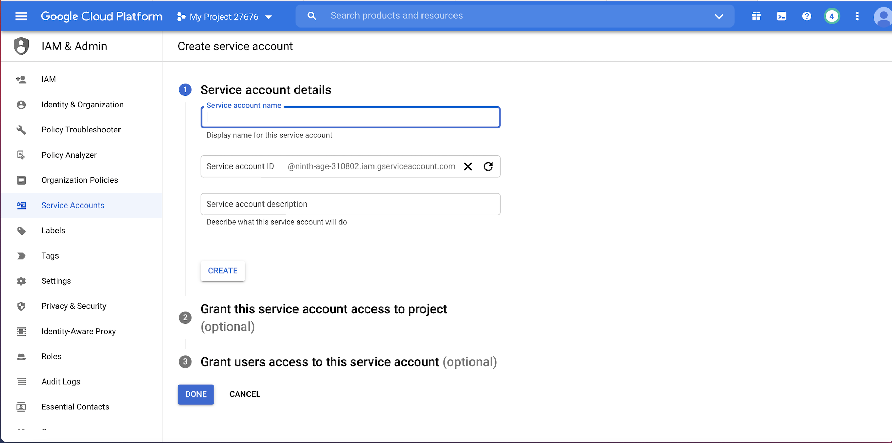
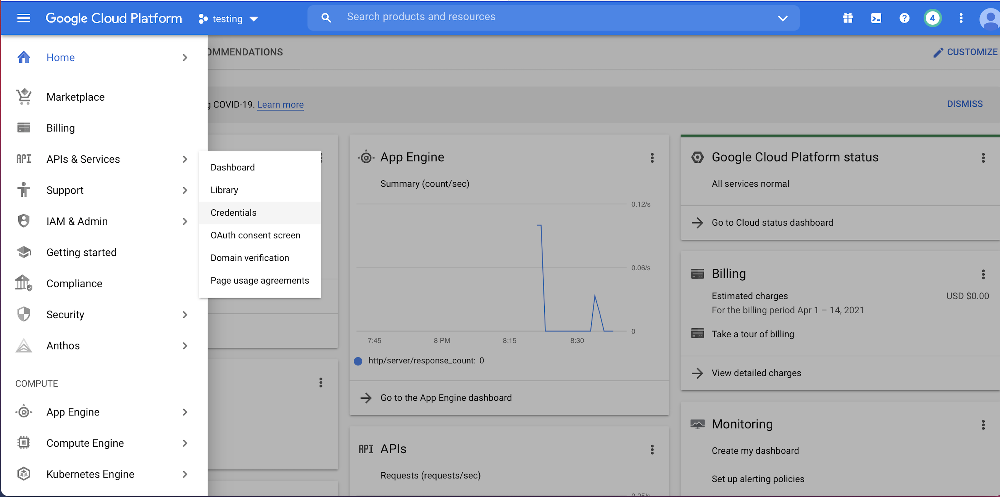
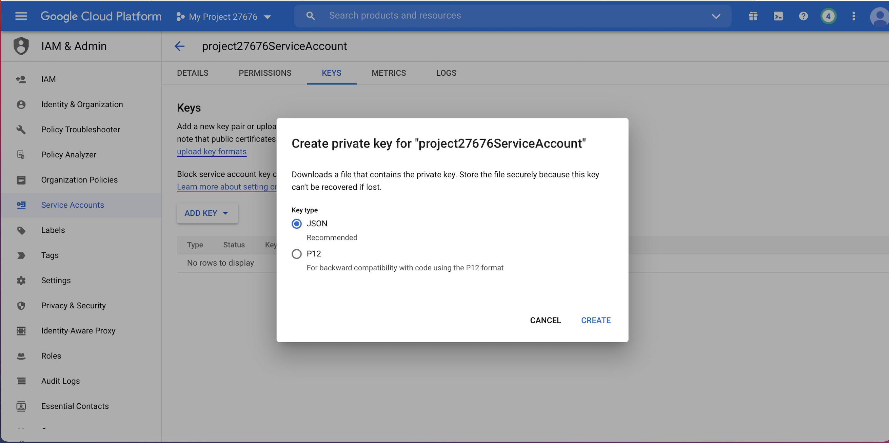

#SAAS-Google-Cloud-Vision-API

URL: [https://crafty-chiller-310323.uc.r.appspot.com/](https://crafty-chiller-310323.uc.r.appspot.com/)

## App Running

## Explanation

### Creating Cloud Set-Up

Create a new project in your Google cloud console.

Add your Project Name

Click Create

Go to Your Project

From Navigation menu Go to

	App Engine => Dashboard
	

Click Create Appliaction

In language select Java

Click Next

Go To API Services 

Search Cloud Vision API

Enable API

Go to IAM & Admin 

Go to Service Account

Create service

Go to APIs & Services => Credentials => Create credentials

### Ecllipse Setup & Project Explannation

Go to App Engine in the ecllipse.
Click on Create New Project

Go to Google App Engine Standard Java Project
Add your Project name.

Check Create as Maven Project.

Add neccessary dependencies in pom.xml file. In this google-cloud-vision - artifact is necessary for detecting labels. 

After that create application jsp pages and their corresponding servlets.
index.jsp: This page allows to upload image to the application.
The Upload.java servlet gets the requests. 

**index.jsp** - Allows us to upload an image.

**Upload.java** - It is a servlet that gets the request. After receiving the request, the image is converted to blobbytes. BLOB allows us to manage the creation and serving of large, immutable blobs to users. After that it is processed in the method getImageLabels() in order to to fetch the image labels  by using the Google CV api. The fetched label results are then redirected to the view using labels.jsp

**BlobstoreService** - 

com.google.appengine.api.blobstore
BLOB - Binary Large OBject.BLOB is a collection of binary data that is stored as a single entity.

[https://cloud.google.com/appengine/docs/standard/java/javadoc/com/google/appengine/api/blobstore/BlobstoreService](https://cloud.google.com/appengine/docs/standard/java/javadoc/com/google/appengine/api/blobstore/BlobstoreService)
 

**Send feedback AnnotateImageRequest** - This API requests for performing Google Cloud Vision API tasks over a user-provided image, with user-requested features, and with context information.

[https://cloud.google.com/vision/docs/reference/rest/v1/AnnotateImageRequest](https://cloud.google.com/vision/docs/reference/rest/v1/AnnotateImageRequest)

After creating app deploy your project to google cloud in the cloud project created.

### State of system :- This application runs properly and able to detect images

 